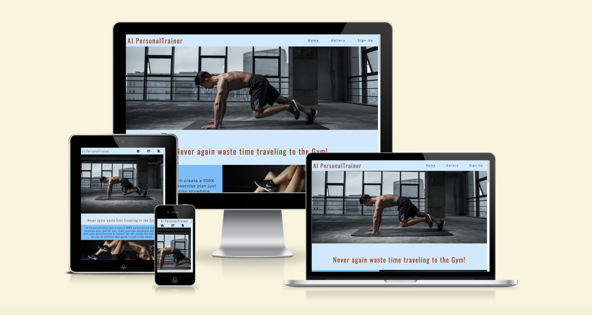
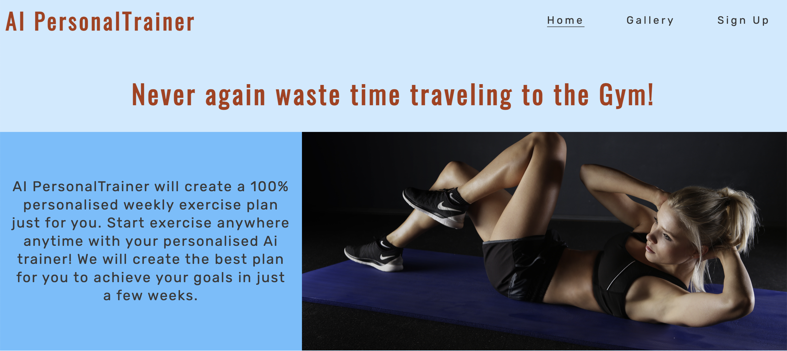
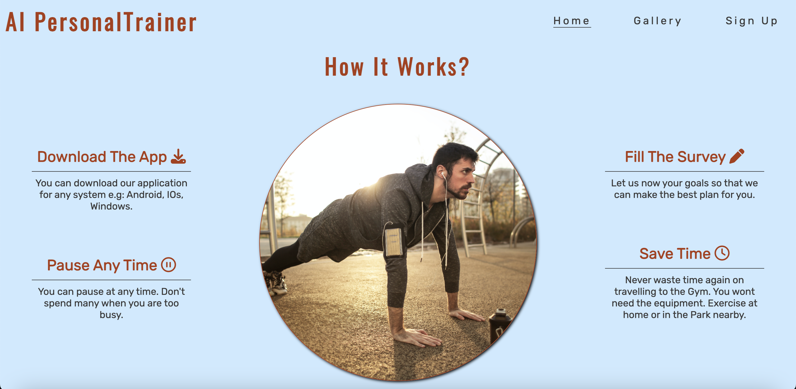
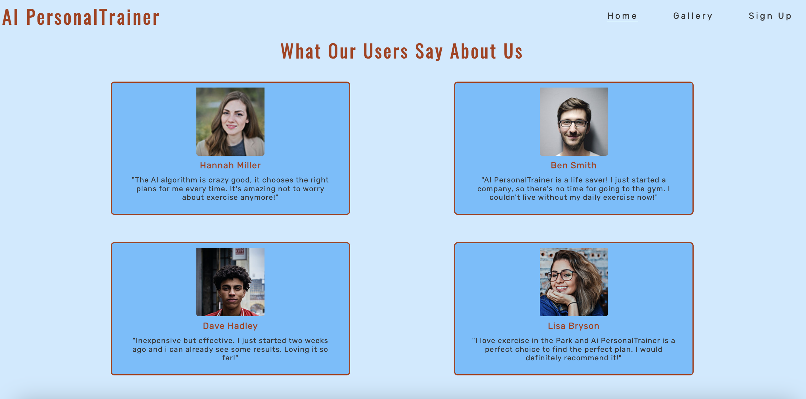
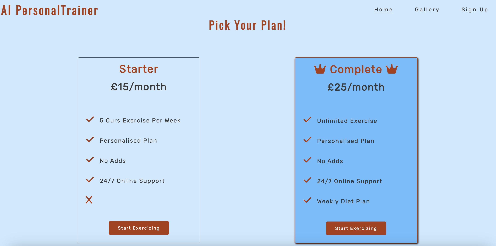
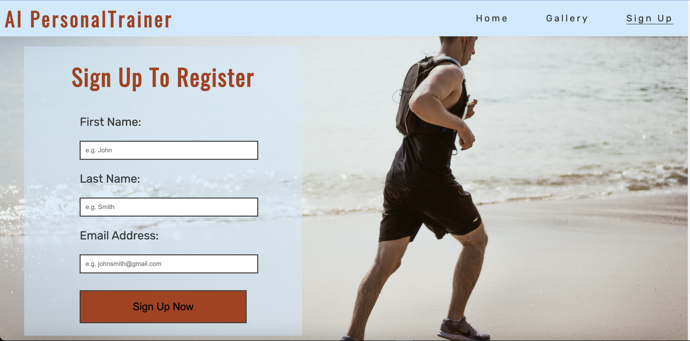

# AI PersonalTrainer #

This page is a landing page of a fictive application.
The applications AI algorithm creates a plan for exercise according to the received details from the user. (thier goals current shape and time that they can spend with exercising) .
The users dont't need to go to the Gym. They can exercise at home or in a park etc.

## User Stories ##

* As a visiting user i would like to see the subject matter of the page.
* As a visiting user i would like to sign up for an exercise website.
* As a visiting user i would like to see the features of the particular website why should i choose that one.
* As a visiting user i would like to see the prices.
* As a visiting user i would like to see what people think of the application whom already tried.

## Features ##

### Header ###

* The header is responsive looks good on any type of screen.
* All the links work and navigate to the desired part of the site.
* All the link will change thier colors when hovered over.
* The external links will open in a new tab.
* The header made to be sticky so that the user don't need to scroll to the top of the page to navigate to a separeta page.
* Featured on all three pages, the full responsive navigation bar includes links to the Logo, Home page, Gallery and Sign Up page and is identical in each page to allow for easy navigation.

### Hero Section ###

* The hero image is responsive doesn't look streched or pixeled on any type of screen.
* The image has alt attribute for accessibility.
* The image was choosen with respect to the content of the page so it's aproppriate.

### Aside section ###

* This section explains what the application is about.
* The section is responsive looks good in any size of screen.
* The pictures are not streched or pixeled and have alt attribute for accessibility.

### How it Works Section  ###

* This section highlights the features of the application to help for the visitor to decide if it's suitable for them.
* Using Fontawsome icons for designe purposes.
* The section is responsive and looks good on any size of screen.

### Testimonials section ###

* The purpose of this section is that the user can see other people reviews so they feel more comfortable with the application.
* The images has alt attribute for accessibility.
* The section looks good on any size of screen.   

### Pricing Section ###

* The purpose of this section is that the user can see the different options and thier features.
* The complete option is the best value so it's a bit highlited with more design.
* Both cards have a start button so the user can navigate to the sign up page. 
* Both cards use Fontawsome icons for designe purposes.
* The section is responsive and looks good on any size of screen.

### Sign Up Page ###

* The users can fill the form and register here.
* The form requires first name, last name and email address.
* All the fields are mandatory.
* The email field doesn't accept non valid emial.
* The fields have placeholder attributes to help the user.
* The section is responsive and looks good on any size of screen.

### Gallery ###

* The user can navigate to the gallery from the menu.
* The site will open in a new tab and the user can navigate back to the main page easily through the nav bar.
* The images are not streched or pixeled.
* They have alt attribute for accessibility.
* The images are appropriate to the content.
* The gallery is responsive and looks good on any size of screen.

### The Footer ###

* The footer section includes links to the relevant social media sites for AI PersonalTrainer. The links will open to a new tab to allow easy navigation for the user.
* The footer is valuable to the user as it encourages them to keep connected via social media.

The live link can be found here: https://tamassomi.github.io/AI-PersonalTrainer/

## Future features ##

- A survey to collect data from the users to improve the application.

## Typography and color scheme ##

- Main background color: #CCEAFF
- Secondary background: color: #66BFFF
- Logos and headers: #AC3B15
- Text color: 3a3a3a;

- I used Rubik for text an Oswald fonts for headres from: https://fonts.google.com/

