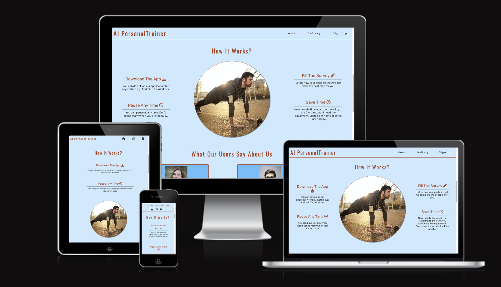
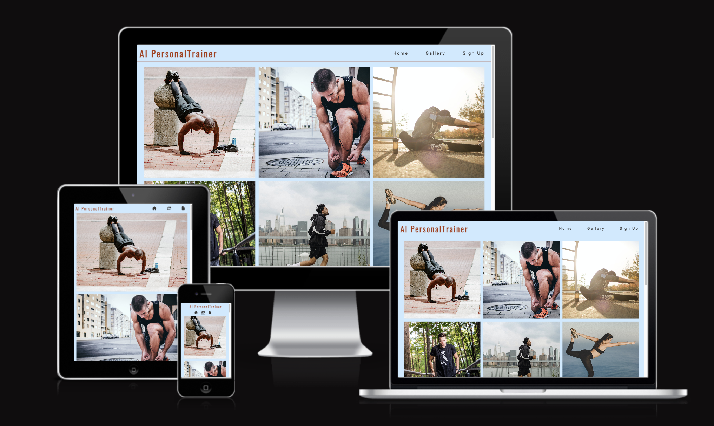

# AI PersonalTrainer #

This page is a landing page of a fictive application.
The applications AI algorithm creates a plan for exercise according to the received details from the user. (thier goals current shape and time that they can spend with exercising) .
The users dont't need to go to the Gym. They can exercise at home or in a park etc.

The live link can be found here: 
[Visit Webpage](https://tamassomi.github.io/AI-PersonalTrainer/)

## User Stories ##

* As a visiting user i would like to see the subject matter of the page.
* As a visiting user i would like to sign up for an exercise website.
* As a visiting user i would like to see the features of the particular website why should i choose that one.
* As a visiting user i would like to see the prices.
* As a visiting user i would like to see what people think of the application whom already tried.

- - - -

## Features ##

### Header ###

* The header is responsive looks good on any type of screen.
* All the links work and navigate to the desired part of the site.
* All the link will change thier colors when hovered over.
* The external links will open in a new tab.
* The header made to be sticky so that the user don't need to scroll to the top of the page to navigate to a separeta page.
* Featured on all three pages, the full responsive navigation bar includes links to the Logo, Home page, Gallery and Sign Up page and is identical in each page to allow for easy navigation.

### Hero Section ###

* The hero image is responsive doesn't look streched or pixeled on any type of screen.
* The image has alt attribute for accessibility.
* The image was choosen with respect to the content of the page so it's aproppriate.

### Aside section ###

* This section explains what the application is about.
* The section is responsive looks good in any size of screen.
* The pictures are not streched or pixeled and have alt attribute for accessibility.

### How it Works Section  ###

* This section highlights the features of the application to help for the visitor to decide if it's suitable for them.
* Using Fontawsome icons for designe purposes.
* The section is responsive and looks good on any size of screen.

### Testimonials section ###

* The purpose of this section is that the user can see other people reviews so they feel more comfortable with the application.
* The images has alt attribute for accessibility.
* The section looks good on any size of screen.   

### Pricing Section ###

* The purpose of this section is that the user can see the different options and thier features.
* The complete option is the best value so it's a bit highlited with more design.
* Both cards have a start button so the user can navigate to the sign up page. 
* Both cards use Fontawsome icons for designe purposes.
* The section is responsive and looks good on any size of screen.

### Sign Up Page ###

* The users can fill the form and register here.
* The form requires first name, last name and email address.
* All the fields are mandatory.
* The email field doesn't accept non valid emial.
* The fields have placeholder attributes to help the user.
* The section is responsive and looks good on any size of screen.

### Gallery ###

* The user can navigate to the gallery from the menu.
* The user can navigate back to the main page easily through the nav bar or clicking on the logo.
* The images are not streched or pixeled.
* They have alt attribute for accessibility.
* The images are appropriate to the content.
* The gallery is responsive and looks good on any size of screen.

### The Footer ###

* The footer section includes links to the relevant social media sites for AI PersonalTrainer. The links will open to a new tab to allow easy navigation for the user.
* The footer is valuable to the user as it encourages them to keep connected via social media.

The live link can be found here: [Visit Webpage](https://tamassomi.github.io/AI-PersonalTrainer/)

- - - -

## Future features and improvements ##

- A survey to collect data from the users to improve the application.
- As this is my first project i just reallised in the end that i could implement a consistant spacing system. In the future i will improve the site with that.

- - - -

## Typography, Color Scheme ans Accessibility ##

- Main background color: #CCEAFF
- Secondary background: color: #66BFFF
- Logos and headers: #AC3B15
- Text color: 3a3a3a;
- I used Rubik for text an Oswald fonts for headers from: https://fonts.google.com/
- Color contrast checked and no alerts or errors found for contrast.
(The error and alerts are because wave did not recognise the Font Awsome icons in the nav links as text for the responsive header.)

- - - -

## Wireframes ##

Basic wireframes were created using:  [Balsamiq](https://balsamiq.com/wireframes/?gclid=CjwKCAiAioifBhAXEiwApzCztmrYyxAPBxLRN4Bwln_l2_qnf61z9Q9qNSW19hUH5Altv9asetRaQBoChAgQAvD_BwE "Balsamiq"). 

During the deployment proccess i changed a few elements.

Markup : 

           
Wireframe for desktop and tablets

           
         

Markup : 

           
Mobile wireframe

           
         

- - - -

## Design and techniques ##

* When i started the project i made some wireframes by drawing and implemented on Balsamic (Does not look so good, i need to improve or next time might use photoshop instead.)
* After i designed the page using HTML and CSS on Gitpod. For hosting the page i use Github.

- - - -

## Testing and bugs ##

## Test Cases ##

* To open the page go to [Github repository](https://github.com/TamasSomi/AI-PersonalTrainer)
* Click on the green gitpod button
* To open the live server use the python3 -m http.server command in the terminal.
* A window will pop up on the right bottom of the screen, click on the open in browser button.

### Main Page ###

* The user should notice a navbar with tree links.
* By hovering over an underline animation will indicate the action.
* The active page will be always underlined.
* By clicking on any of the nav elements the page should open in the same tab.

### Gallery ###

* The user should notice 11 images.
* Now in the nav the gallery is underlined as this is the active page.

### Sign Up Page ###

* The user should notice 3 fields with thier labels, First Name, Last Name, Email Address, and a Sign Up button.
* All the fields are mandatory, if the user try to submit without filling up any of the fields, an alert should pop up.
* If the user try to submit with a non valid email address, an alert should pop up.

### Confirmation Page ###

* The user should be taken here, after succsessfully submitting the form.
* The user should notice a Congratulation heading and a Back To Home Page button.
* The button takes the user back to the home page in the same tab.

- - - -
### Unfixed Bugs ###

* Images in the gallery load a bit slowly. The problem could be solved by reducing the files with squoosh. But as it is just a learning project, i think it would take too many time to upload and reduce and replace them in github as well one by one.

- - - -
### Responsiveness ##

* All pages have been tested for screens from 240px and up.
* I used Chrome Developer Tool for testing and i tested all the pages with all the avialable phone simulations both in verical and horizontal mode.
* The site is responsive on any screensizes and the images are not pixelled or stretched.

- - - -
### Code Validation ###

* HTML: The code passed the official [W3C validator](https://validator.w3.org/nu/?doc=https%3A%2F%2Ftamassomi.github.io%2FAI-PersonalTrainer%2F "W3C validator")

* CSS The css code passed the official [Jigsaw validator](https://jigsaw.w3.org/css-validator/validator?uri=https%3A%2F%2Ftamassomi.github.io%2FAI-PersonalTrainer%2F&profile=css3svg&usermedium=all&warning=1&vextwarning=&lang=en "Jigsaw validator")

- - - -
### Deployment ###

The page was deployed to Github pages using gitpod.

* All files and code has been submitted to Github pages using the 'git add', 'git commit' and 'git push' commands. Published the site by opening the settings - pages - main branch options.

- - - -
## Credits ##

* The layout is inspired by [Love Running Project](https://github.com/TamasSomi/love-running "Love Running Project") (How it works section) and helped me a lot with the form and the media queries.
* The icons used from  [Font Awsome](https://fontawesome.com/ "Font Awsome")
* I learnt css Flexbox and Grid from [CodeCAdemy](https://www.codecademy.com/learn/learn-css-flexbox-and-grid "CodeCademy")
* [W3Scools](https://www.w3schools.com/ "W3Scools") helped me a lot when i struggled with something.

### Media ###

* I downloaded all the images from [Pexels](https://www.pexels.com/ "Pexels")
* The icons from [Font Awsome](https://fontawesome.com/ "Font Awsome")
* The fonts i used [Google Fonts](https://fonts.google.com/ "Google Fonts")
* I found the colors on [Adobe Color Creator](https://color.adobe.com/create/color-wheel# "Adobe Color Creator")
- - - -